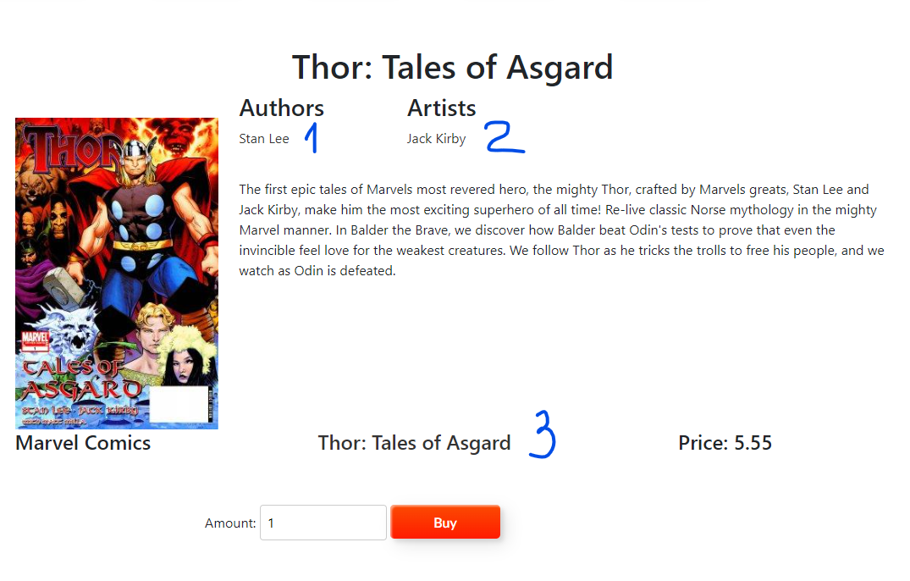

логин - пароль 
ADMIN:
admin - admin

Данное MVC приложения является симулятором работы магазина комиксов.

    Инструменты

Back-end:
Spring, Spring Boot, Spring MVC, Spring Security, Hibernate, Mapstruct

Front-end:
HTML, CSS, JavaScript, Thymeleaf, bootstrap

База данных:
Postgresql, Docker, Liquibase
______________________________________
    Роли пользователя приложением

Это приложение написано с учетом 3‑х ролей пользователей.

Далее будут описаны роли пользователей и их возможности.

1) не аутентифицированный пользователь:
   1) Просматривать
      1) товары
      2) авторов
      3) серии
      4) художников
   2) добавлять товары в корзину
   3) совершать покупки
   4) регистрироваться
______________________________________
2) USER:
    1) имеет все те-же возможности, что и не аутентифицированный пользователь
    2) доступ к личному кабинету
    3) просматривать свою историю покупок
    4) добавлять в избранное и отслеживать в личном кабинете 
       1) авторов
       2) художников 
       3) серии
    5) изменять личные данные (такие, как адрес)
    6) при первой покупке если адрес пользователя был пустым то введенный адрес сохраняется как основной
______________________________________
3) ADMIN:
   1) имеет все те-же возможности, что и предыдущие пользователи
   2) совершать все CRUD операции над
      1) авторами
      2) сериями
      3) художниками
      4) издательствами
      5) комиксами
   3) регистрация других администраторов

______________________________________
    Работа приложения

Данное приложения для своей работы использует Docker на портах 5432:5432 (База данных) и 5433:5433 (Adminer)
А так-же порт 8080:8080 для хоста.

После клика на любой из комиксов вы попадаете в меню комикса

 1 - ссылка на автора
 2 - ссылка на художника
 3 - ссылка на серию

При клике на кнопку "купить" комикс добавляется в корзину пользователя.

При переходе на вкладку корзины мы можем увидеть все добавленные в нее комиксы, стоимость каждого, а так-же общую стоимость

Здесь мы можем совершать изменения над сущностями в корзине

После клика на кнопку оплатить применяются все изменения в кол-ве комиксов и происходит переход на странницу заполнения
личной информации

не аутентифицированный пользователь или пользователь с не заполненной информацией

аутентифицированный пользователь с заполненной информацией

При нажатии на кнопку продолжить происходит сохранение заказа и пользовательской информации если ее еще нет в бд.
В противном случае она находится и подставляется в заказ. В дальнейшем будет происходить переход на систему оплаты 
и передача туда необходимой информации.
______
Если мы перейдем на страницу автора/художника/серии, то мы сможем увидеть все комиксы написанные им

Так-же рядом с именем мы можем видеть серое сердечко. При нажатии на него аутентифицированный пользователь
добавляет его в избранное и сердечко изменяет цвет на красное

В противном случае пользователь отправляется на страницу аутентификации
______
Аутентификация происходит при нажатии на кнопку "Вход" или "Кабинет"

Здесь нужно аутентифицироваться или перейти на страницу регистрации

В личном кабинете можно
1) просматривать свою историю покупок
2) отслеживать
   1) авторов
   2) художников
   3) серии
3) изменять личные данные

При нажатии на "Избранные авторы" пользователь может увидеть всех авторов и их комиксов,
которых он отслеживает, а при нажатии на имя автора он перейдет на страницу автора. Это нужно, тк на самой странице не 
отображается больше трех авторов/художников/серий и их 4-х комиксов

В личном кабинете

На странице отслеживаемых авторов

_____

После аутентификации в роли ADMIN в верхнем навигационном меню появляется кнопка "Админ меню"
При нажатии на нее мы переходим в меню администратора, где мы можем совершать CRUD операции над сущностями, а так-же 
создавать новых администраторов
