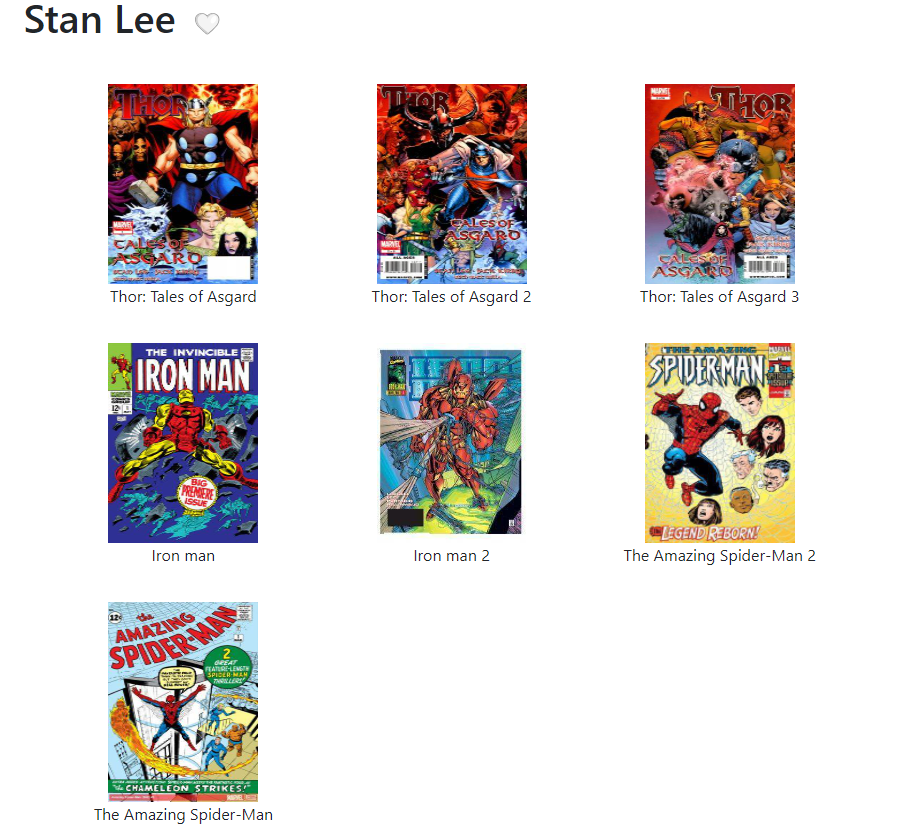
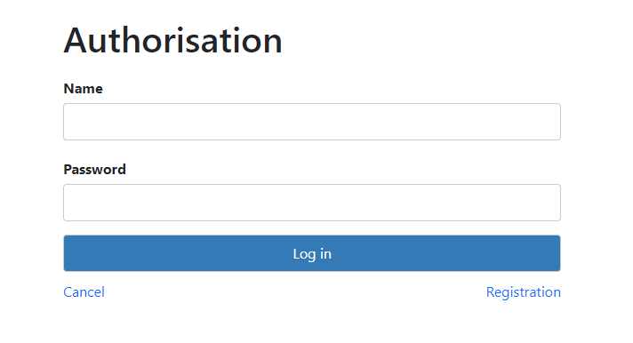
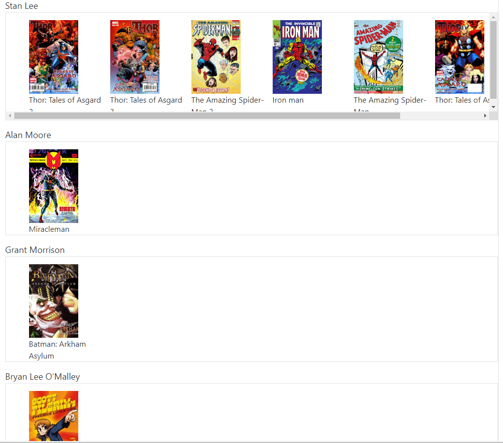

    Login Information:

ADMIN:

Username: admin

Password: admin

___________________
    Tools

Back-end:
* Spring
* Spring Boot
* Spring MVC
* Spring Security
* Hibernate
* Mapstruct

Front-end:
* HTML
* CSS
* JavaScript
* Thymeleaf
* Bootstrap

Database:
* Postgresql
* Docker
* Liquibase
______________________________________
    User roles

In this app user can have 3 different roles.

1) Unauthenticated user:
    1) Check:
        1) goods
        2) authors
        3) series
        4) artists
    2) add goods to the cart
    3) buy goods
    4) register

______________________________________

2) USER:
    1) all actions available to unauthenticated users
    2) access to personal account
    3) view orders history
    4) add and view selected
        1) authors
        2) artists
        3) series
    5) change personal information

______________________________________

3) ADMIN:
    1) all actions available to other users
    2) perform CRUD operation:
        1) authors
        2) series
        3) artists
        4) publishers
        5) comics
    3) register new admins

______________________________________
    Application operation

This MVC app is simulator of E-shop.

This application uses Docker with ports 5432:5432 (database), 5433:5433 (Adminer) and 8080:8080(hosting).

After clicking on any comic you will be directed to the comic menu.

 1 - Link to the author / 2 - Link to the artist / 3 - Link to the series

After clicking the "Buy" button comic will be added to a user's cart.

In the cart, you can see all added comics, the price of each one and total price.

Here you can make changes to the items in the cart.

After clicking the "Buy" button, all changes in the quantity of comics is confirmed, and you proceed to personal
information
filling page.

   If user is authenticated and already fill personal information, the page will autofill   

After clicking the "Continue" button, order will be saved in bd.
in the future there are plans to add payment system and transfer all the data to it.
______
If you move to an author/artist/series page, you will see all the comics associated with them.

Near the author's name, you can see a grey heart. If authenticated user clicks on it, he will add author to selected,
and
heart will change colour to red.

In other scenario he will be redirected to a login page.
______
Also, user can access login page by click on "Log in" or "Cabinet".

Here you can log in or move to a registration page.

______
In personal account user can:

1) check order history
2) track
    1) authors
    2) artists
    3) series
3) change personal information

In the user's cabinet you can see at most 3 selected authors/artists/series and their 4 comics.
After clicking on "Selected authors" shows all selected authors,
and by clicking on the author's name you will be redirected to the author's page.

In personal account 

On selected authors page 

________________________________

    Admin features

After authentication as an ADMIN, an "Admin menu" button appears in the navigation menu.
In this menu, you can perform CRUD operations on entities and create new admins.
